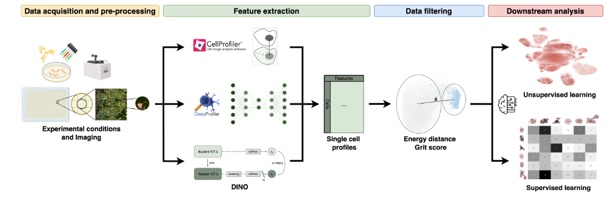

# Single-Cell Morphological Profiling Reveals Insights into Cell Death  

This repository contains analysis scripts for the paper *"Single-cell morphological profiling reveals insights into cell death"* ([Add Link to Paper]).  

The repository is structured to facilitate reproducibility and includes scripts for supervised and unsupervised analysis, calculation of key metrics, and generation of publication figures.

---

## Repository Structure  

- **`supervised/`**  
  Contains scripts for supervised classification tasks using single-cell and aggregated profiles.  
  - `Supervised_analysis.ipynb`: Jupyter notebook for training supervised models.  
  - `autogluon_classifier_celldeath.py`: Script for model training using AutoGluon.  

- **`unsupervised/`**  
  Contains scripts for clustering and dimensionality reduction tasks.  
  - `Unsupervised_analysis.ipynb`: Jupyter notebook for unsupervised analysis, including UMAP and PCA.

- **`metrics/`**  
  Scripts for calculating perturbation metrics like grit score and e-distance.  
  - `grit_script.py`: Script to calculate grit scores.  
  - `run_etest.py`: Script to calculate e-distances and perform permutation tests.  
  - `etest_grit_analysis.ipynb`: Notebook for analyzing and visualizing metric results.  

- **`visualization/`**  
  Scripts for generating figures and visualizations.  
  - `visualize_attention_Celldeath.py`: Script to generate attention maps and related plots.

- **`config/`**  
  Configuration files for reproducibility.  
  - `config_finetune_unmasked.yaml`: Configuration for training DINO models. Note: We do not provide all imaging data here.

---

## DINO Training  

For DINO training, we adapted the codebase from [DINO4Cells](https://github.com/broadinstitute/DINO4Cells_code). Please refer to their repository for detailed instructions. The checkpoints to our model can found in [add FigShare].

---

## CellViewer  

To obtain representative cell images shown in Fig. 3, Suppl. Fig. S5–S7, S9, S10, and S14, we used the **CellViewer** tool. The code for CellViewer is available at [Add CellViewer GitHub Link].

---

## Data Availability
Processed data and extracted features can be found in [add FigShare]

## Citation
If you use this code or data, please cite:
Single-cell morphological profiling reveals insights into cell death ([Add DOI/Link to Paper])
