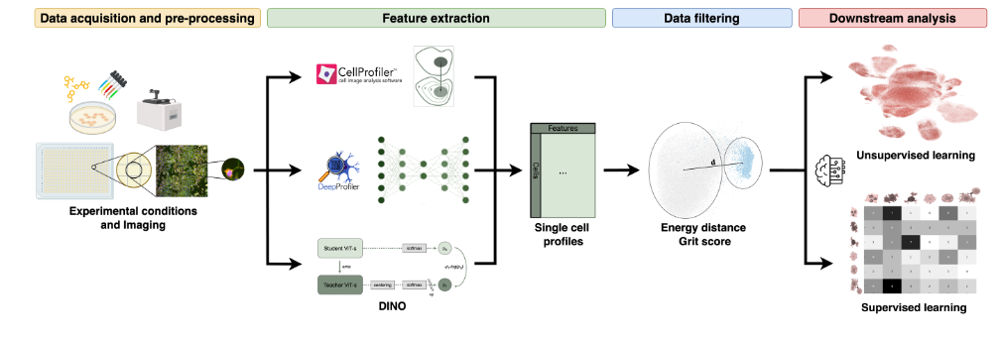

# Single-Cell Morphological Profiling Reveals Insights into Cell Death  

This repository contains analysis scripts for the paper *"Single-cell morphological profiling reveals insights into cell death"* (https://www.biorxiv.org/content/10.1101/2025.01.15.633042v1).  

The repository is structured to facilitate reproducibility and includes scripts for supervised and unsupervised analysis, calculation of key metrics, and generation of publication figures.



---

## Repository Structure  

- **`supervised/`**  
  Contains scripts for supervised classification tasks using single-cell and aggregated profiles.  
  - `Supervised_analysis.ipynb`: Jupyter notebook for evaluation of supervised models.  
  - `autogluon_classifier_celldeath.py`: Script for model training using AutoGluon.  

- **`unsupervised/`**  
  Contains scripts for clustering and dimensionality reduction tasks.  
  - `Unsupervised_analysis.ipynb`: Jupyter notebook for unsupervised analysis, including UMAP and PCA.

- **`metrics/`**  
  Scripts for calculating perturbation metrics like grit score and e-distance.  
  - `grit_script.py`: Script to calculate grit scores.  
  - `run_etest.py`: Script to calculate e-distances and perform permutation tests.  
  - `etest_grit_analysis.ipynb`: Notebook for analyzing and visualizing metric results.  

- **`visualization/`**  
  Scripts for generating figures and visualizations.  
  - `visualize_attention_Celldeath.py`: Script to generate attention maps and related plots.

- **`config/`**  
  Configuration files for reproducibility.  
  - `config_finetune_unmasked.yaml`: Configuration for training DINO models. Note: We do not provide all imaging data here.

- **`data_prep/`**  
  Data preparation files for different feature extractors.  
  - `data_prep.py`: File with main normalization and plate concatenation functions
  - `CellProfiler_FeatureExtraction.py`: Function for feature selection and QC of CellProfiler features.
  - `CellProfiler_QC.py`: Quality control functions, needs to be linked to database (proprietary internal structure).
  - `utils.py`: Utils for data_prep.py

---

## DINO Training  

For DINO training, we adapted the codebase from [DINO4Cells](https://github.com/broadinstitute/DINO4Cells_code). Please refer to their repository for detailed instructions. The checkpoints to our model can found in [FigShare](https://doi.org/10.17044/scilifelab.28202864.v1).

---

## CellViewer  

To obtain representative cell images shown in Fig. 3, Suppl. Fig. S5–S7, S9, S10, and S14, we used the **CellViewer** tool. The code for CellViewer is available at [CellViewer](https://github.com/pharmbio/CellViewer).

---

## Data Availability
Extracted features can be found on [FigShare](https://doi.org/10.17044/scilifelab.28202864.v1). Provided are normalised profiles. Aggregation and analysis steps can be found in the scripts. Grit scores and e-distance result can be found on FigShare.

## Citation
If you use this code or data, please cite:

```bibtex
@article{frey_single-cell_2025,
  title   = {Single-cell morphological profiling reveals insights into cell death},
  author  = {Frey, Benjamin and Holmberg, David and Byström, Petter and Bergman, Ebba and Georgiev, Polina and Johansson, Martin and Hennig, Patrick and Rietdijk, Jonne and Rosén, Dan and Carreras-Puigvert, Jordi and Spjuth, Ola},
  journal = {bioRxiv},
  year    = {2025},
  doi     = {10.1101/2025.01.15.633042},
  url     = {https://www.biorxiv.org/content/early/2025/01/19/2025.01.15.633042}
}
